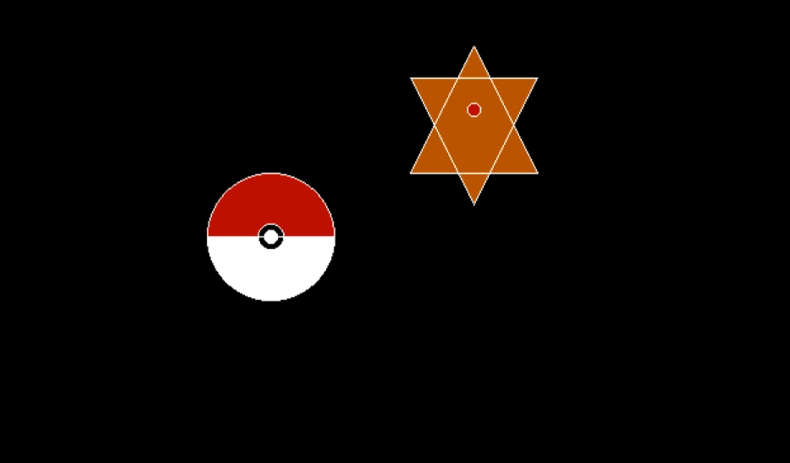

# Pokemon-Catching-Animation-in-c

<h2>Introduction Idea </h2>
The aim of the project is to achieve a nearest possible animation of a cartoon series called Pokémon. In this we are trying to achieve a simple Poke ball (bouncing ball), based on the principles of the show that tries to capture a Pokémon.
The animation starts with the Poke ball being thrown at the Pokémon and after reaching the Pokémon the poke ball will open and capture it, followed by a big flash.
The Pokémon will try to capture the Pokémon by bouncing rapidly and when the Pokémon will get captured, it will start slowing down and stop, ending the animation.

<h2> Objective </h2> 
The program would use the concepts of designing and translation of various objects along with the application of boundary fill and flood fill in C/C++.

<h2> Hardware & Software</h2> 
The Hardware used would be HP (Hewlett Packard) G3 pro-book and the software used will be TurboC++ with utilization of graphics.h , dos.h, stdio.h & stdlib.h libraries .

<h2>  System requirement </h2> 
o	At least 128 MB RAM 
o	Windows XP sp3 or Dos Box 
o	TurboC++ ( IDE 3.0 16-bit)  
o	16-bit environment 

<h2> Methodology </h2> 
The Poke ball is designed using the sector function provided in the graphics.h library and three concentric circles, with a simple translational motion to reach the Pokémon. The Pokémon is star shaped (comprising of circle, hardcoded lines) character i.e., Staryu. Once the Poke ball reaches the Pokémon the ball will split open and engulf the Pokémon but if it fails it will break into pieces. 
 This is just a hardcoded animation and game can be built over this by simply calling the methods created for each element (Pokémon, Poke ball, translation and bouncing) in the main file.

<h2> Expected Outcome</h2> 
A nearest possible and realistic animation of the Pokémon being captured by the Poke ball. Thus, implementing the graphics libraries covering the basic and conceptual grounds of Computer Graphics and Multimedia (CGM).   

<h3> References </h3> 
•	YouTube tutorials on bouncing ball in TurboC++. 
•	Pokémon shows for inspiration. 
•	TurboC++ software. 
